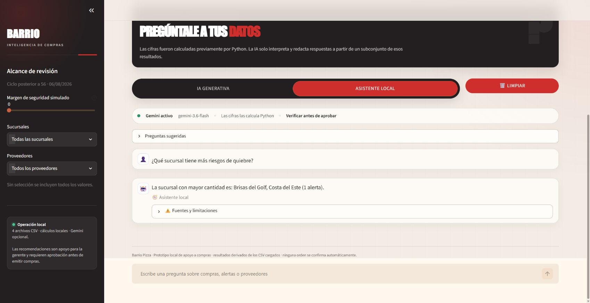
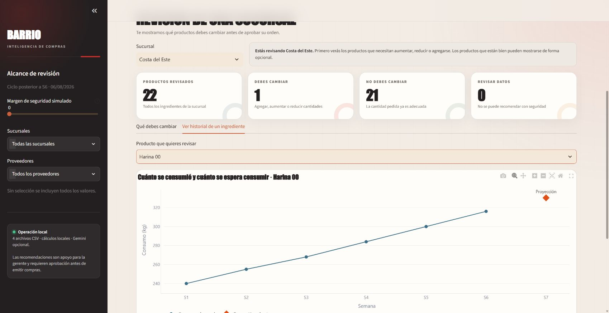
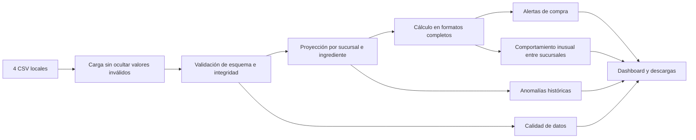

# Barrio Pizza | Asistente Inteligente de Compras

Prototipo funcional en Python y Streamlit para revisar las órdenes semanales de compra de Barrio Pizza. Convierte consumo, inventario y formatos de proveedor a una recomendación explicable; identifica riesgos de quiebre, productos omitidos, sobrepedidos y problemas de datos antes de que una gerente apruebe la orden.

El motor de compras y el asistente local funcionan completamente sin claves de API. La variante `app_intelligent.py` puede usar Gemini de forma opcional para interpretar resultados ya calculados; si la integración no está configurada o falla, vuelve automáticamente al asistente local. Las recomendaciones son apoyo a la decisión y siempre requieren aprobación humana.

> El enunciado recibido se preserva sin cambios en [`docs/RETO_ORIGINAL.md`](docs/RETO_ORIGINAL.md).

## Capturas del producto

### Resumen ejecutivo


La vista principal concentra las 88 líneas revisadas y muestra en una sola lectura el porcentaje sin ajuste, los riesgos de quiebre, los sobrepedidos y los errores de datos. La aclaración evita sumar dos veces las señales comparativas entre sucursales.

### Asistente inteligente con evidencia



El chat responde sobre cifras calculadas previamente por Python, identifica el modo utilizado y conserva las fuentes en un panel desplegable. Si Gemini no está disponible, la misma interfaz continúa con el asistente local.

### Tendencia creciente y recomendación



El detalle de Costa del Este muestra el crecimiento de Harina 00 durante S1–S6 y la proyección S7. En la misma vista se observan inventario, consumo esperado, necesidad, formatos ordenados y recomendados.

## Descripción del problema de negocio

Las sucursales preparan órdenes en formatos completos —sacos, cajas, latas, paquetes o unidades—, mientras que consumo e inventario se registran en unidad base. Una revisión manual debe combinar unidades, stock, comportamiento histórico y excepciones de calidad. Este producto automatiza esa comparación sin ocultar datos dudosos ni inventar información que no existe.

## Funcionalidades

- Resumen ejecutivo con KPIs, prioridades y gráficos por sucursal y tipo de alerta.
- Sistema visual adaptable inspirado en la experiencia pública de Barrio Pizza, con navegación accesible, panel lateral recuperable y cursor de pizza orientado como puntero convencional.
- Alertas accionables con severidad, proveedor, perecedero, cantidades en formatos y unidad base.
- Benchmarking de órdenes entre sucursales, normalizado por recomendación y con evidencia de pares.
- Cuadrícula completa de sucursal e ingrediente derivada del histórico y del catálogo.
- Detección explícita de productos omitidos y artículos pedidos fuera de catálogo.
- Proyección robusta con MAD, exclusión condicionada de atípicos y tendencia lineal defendible.
- Comparación opcional con el promedio simple de seis semanas.
- Detalle histórico y explicación del método por sucursal e ingrediente.
- Simulador con carga CSV, edición en línea, restablecimiento y recálculo inmediato.
- Orden corregida completa y descargas separadas por proveedor.
- Área independiente para calidad de datos y anomalías históricas.
- Asistente local de consultas frecuentes en español, basado en reglas y sin APIs externas.
- Variante opcional de chat con Gemini, salida estructurada, referencias de evidencia y respaldo local automático.
- Margen de seguridad opcional de 0% a 20%, identificado claramente como simulación.

## Arquitectura

La interfaz no contiene las reglas principales. El flujo es unidireccional y cada etapa devuelve tablas auditables:



- `data_loader.py`: lectura de fuentes sin convertir silenciosamente valores inválidos.
- `validation.py`: esquema, tipos, claves, referencias y cobertura completa.
- `forecasting.py`: MAD, regresión, confianza y explicación.
- `purchasing.py`: conversiones, necesidad, redondeo y estado de cada línea.
- `benchmarking.py`: comparación robusta de cada orden contra sucursales pares del mismo ingrediente.
- `alerts.py`: severidad y textos accionables.
- `ui_helpers.py`: filtros, exportación, estilo y consultas locales.
- `gemini_assistant.py`: selección de evidencia, contexto JSON compacto, validación de salida y fallback seguro.
- `intelligent_ui.py`: selector IA/local, preguntas sugeridas, historial y controles de conversación.
- `design_system.py`: tokens, componentes visuales y tema Plotly inspirados en la experiencia pública de Barrio Pizza.
- `variantes iniciales/app.py`: composición de la experiencia Streamlit original.
- `variantes iniciales/app_barrio_style.py`: variante que reutiliza la experiencia original con el sistema visual alternativo.
- `variantes iniciales/app_profesional.py`: centro ejecutivo reutilizado por la entrega inteligente.
- `app_intelligent.py`: variante del centro ejecutivo con Gemini opcional y asistente local de respaldo.
- `variantes iniciales/app_shiny.py`: rediseño alternativo con Shiny; reutiliza los mismos módulos de negocio.

Todos los `merge` relevantes declaran su cardinalidad con `validate="many_to_one"`, `"one_to_one"` o el equivalente apropiado.

## Estructura del repositorio

```text
.
├── app_intelligent.py
├── variantes iniciales/
│   ├── app.py
│   ├── app_barrio_style.py
│   ├── app_profesional.py
│   └── app_shiny.py
├── datos/
│   ├── ingredientes.csv
│   ├── consumo_historico.csv
│   ├── inventario_actual.csv
│   └── orden_compra_semana.csv
├── src/
│   ├── __init__.py
│   ├── data_loader.py
│   ├── validation.py
│   ├── forecasting.py
│   ├── purchasing.py
│   ├── benchmarking.py
│   ├── alerts.py
│   ├── ui_helpers.py
│   ├── gemini_assistant.py
│   ├── intelligent_ui.py
│   └── design_system.py
├── tests/
│   ├── conftest.py
│   ├── test_forecasting.py
│   ├── test_purchasing.py
│   ├── test_benchmarking.py
│   ├── test_validation.py
│   ├── test_sample_data.py
│   ├── test_gemini_assistant.py
│   └── test_design_system.py
├── docs/
│   ├── RETO_ORIGINAL.md
│   └── guion_video.md
├── requirements.txt
├── requirements-shiny.txt
├── pytest.ini
├── README.md
├── AI_USAGE.md
├── .gitignore
└── .streamlit/
    ├── config.toml
    └── secrets.toml.example
```

## Instalación local

Requiere Python 3.10 o superior y Streamlit 1.50 o posterior. Desde la raíz del repositorio:

```bash
python -m venv .venv
```

Activación en Windows:

```bash
.venv\Scripts\activate
```

Instalación:

```bash
pip install -r requirements.txt
```

Ejecución:

```bash
streamlit run app_intelligent.py
```

Pruebas:

```bash
pytest
```

La aplicación abre normalmente en `http://localhost:8501`.

### Variante Streamlit con sistema visual Barrio

`variantes iniciales/app_barrio_style.py` conserva las pestañas, validaciones, proyecciones, fórmulas, simulador y descargas de la versión original, pero sustituye su capa visual mediante `src/design_system.py`. El diseño toma como referencia la composición de alto contraste del sitio público de Barrio Pizza: carbón, rojo, crema, títulos condensados, botones tipo píldora y bloques editoriales. Es una interpretación para este prototipo y no se presenta como manual de marca oficial.

El sistema es autocontenido: no descarga tipografías, imágenes ni recursos externos durante la ejecución. Para abrir esta variante:

```bash
streamlit run "variantes iniciales/app_barrio_style.py"
```

La aplicación abre normalmente en `http://localhost:8501`. Estas variantes se conservan como referencia; la entrega desplegable recomendada es `app_intelligent.py`.

### Centro ejecutivo profesional

`variantes iniciales/app_profesional.py` contiene la arquitectura de producto que reutiliza `app_intelligent.py`. Organiza la revisión en seis espacios de trabajo: vista ejecutiva, centro de alertas, sucursales, mesa de compra, datos y método, y asistente inteligente.

```bash
streamlit run "variantes iniciales/app_profesional.py"
```

Esta variante también puede seleccionarse como archivo principal en Streamlit Community Cloud.

### Variante inteligente con Gemini

`app_intelligent.py` conserva el centro ejecutivo y agrega un selector entre **IA generativa** y **Asistente local**. Los cálculos de proyección, inventario, necesidad, redondeo y recomendación siguen ejecutándose exclusivamente en Python. Gemini no recibe los CSV ni calcula cifras: solo interpreta un subconjunto compacto de los resultados y redacta una respuesta breve con identificadores como `EV-COMPRA-001`.

La integración utiliza el SDK oficial `google-genai` y el modelo `gemini-3.6-flash`. Para activarla:

1. Crear una clave en [Google AI Studio](https://aistudio.google.com/app/apikey).
2. Copiar el archivo de ejemplo en PowerShell:

   ```powershell
   Copy-Item .streamlit\secrets.toml.example .streamlit\secrets.toml
   ```

3. Editar `.streamlit/secrets.toml` sin compartir su contenido:

   ```toml
   GEMINI_API_KEY = "tu_clave_real"
   ```

Como alternativa temporal para la sesión actual de PowerShell:

```powershell
$env:GEMINI_API_KEY="tu_clave_real"
```

El archivo real `.streamlit/secrets.toml` está excluido por `.gitignore` y **no debe subirse a GitHub**. Para abrir la variante:

```bash
streamlit run app_intelligent.py
```

Si falta la clave, no está instalado el SDK, la API devuelve `429`, supera el tiempo de espera o entrega una respuesta inválida, la interfaz usa el asistente local sin interrumpir el dashboard. La consulta a Gemini envía como máximo un conjunto limitado de líneas relevantes, ordenadas por severidad; no envía el historial completo ni columnas fuera del esquema permitido. La respuesta estructurada se valida antes de mostrarse y debe citar los identificadores de evidencia utilizados.

El nivel gratuito del proveedor puede aplicar cuotas y límites de frecuencia. En una implementación productiva se revisarían previamente la política de privacidad, las condiciones del proveedor y la clasificación de la información comercial antes de enviar datos fuera de la organización.

### Rediseño alternativo con Shiny para Python

El repositorio conserva las versiones iniciales de Streamlit e incluye `variantes iniciales/app_shiny.py` como experiencia alternativa. Todas leen los mismos CSV y reutilizan las mismas validaciones, proyecciones, fórmulas y alertas de `src/`; el rediseño no mantiene una segunda lógica de compra.

La variante Shiny utiliza barra lateral adaptable, tarjetas, `value_box`, navegación por paneles, tablas filtrables, gráficos Plotly reactivos, carga de archivos, edición de cantidades y descargas. Para instalar sus dependencias adicionales:

```bash
pip install -r requirements-shiny.txt
```

Ejecución de la versión Shiny:

```bash
shiny run --reload "variantes iniciales/app_shiny.py"
```

La aplicación abre normalmente en `http://127.0.0.1:8000`. Esta variante es para comparación local o para una plataforma compatible con aplicaciones Shiny. Streamlit Community Cloud debe continuar apuntando a `app_intelligent.py`.

## Método de proyección

El objetivo es resistir semanas extrañas sin introducir un modelo difícil de defender.

1. Se extrae el número de etiquetas como `S1`, `S2`, etc. y se ordenan cronológicamente.
2. Se conservan solo observaciones numéricas no negativas para el cálculo; cualquier valor inválido permanece reportado como incidencia.
3. Se calcula la mediana y la desviación absoluta mediana (MAD).
4. Cuando `MAD > 0`, se calcula el modified z-score:

   ```text
   modified_z = 0.6745 × (valor - mediana) / MAD
   ```

5. Un valor con `abs(modified_z) > 3.5` se registra como atípico. Solo se excluye de la proyección si quedan al menos cuatro observaciones válidas.
6. Con los valores limpios se ajusta una regresión lineal simple y se calcula R².
7. Se considera tendencia fuerte únicamente si `R² >= 0.80` y el cambio absoluto entre primera y última semana equivale al menos a 15% del promedio limpio.
8. Con tendencia fuerte se extrapola la semana siguiente; sin ella se usa el promedio limpio.
9. Toda proyección se limita a un mínimo de cero.

Con una o dos semanas se genera una referencia básica y la confianza queda baja. Sin histórico válido no se produce una cifra. La interfaz conserva proyección, método, atípicos, R², confianza, explicación y promedio simple de seis semanas.

## Comportamiento inusual entre sucursales

La comparación evita enfrentar cantidades absolutas, porque una sucursal con mayor demanda puede necesitar legítimamente más formatos. Para cada ingrediente se calcula:

```text
factor_de_orden = formatos_ordenados / formatos_recomendados
```

Cada sucursal se excluye de su propia referencia y se compara contra la mediana y MAD de al menos dos sucursales pares:

1. Con `MAD > 0`, un modified z-score superior a `3.5` o inferior a `-3.5` puede señalar una desviación.
2. Cuando MAD es cero —caso frecuente cuando las sucursales ordenan exactamente `1×` su recomendación— se usa un respaldo transparente: al menos `2×` o como máximo `0.5×` la mediana de los pares.
3. Siempre debe existir al menos un formato completo de diferencia frente a la recomendación. El excedente inevitable dentro del último formato continúa siendo redondeo normal.
4. Las órdenes sin necesidad positiva se señalan solo cuando existe un pedido positivo y la mediana de exceso de los pares es cero.
5. Con dos sucursales pares la confianza es baja; con tres o más es moderada. Esta versión no usa confianza alta.

La pestaña **Comportamiento inusual entre sucursales** muestra tarjetas accionables, gráfico de orden contra recomendación, casos por sucursal, tabla auditable y descarga CSV. Estas señales pueden superponerse con faltantes, sobrepedidos u omisiones y no se suman como productos adicionales. Con solo cuatro sucursales se presentan como contexto de revisión, no como anomalías confirmadas. Los archivos no contienen clientes ni ventas; por eso la comparación se normaliza mediante la recomendación calculada y no se presenta como un indicador por cliente.

## Fórmulas de compra

Con margen de seguridad en 0%:

```python
necesidad_base = max(consumo_proyectado - inventario_actual, 0)

formatos_recomendados = ceil(
    necesidad_base / unidad_base_por_formato
)

cantidad_ordenada_base = (
    cantidad_formatos_ordenados * unidad_base_por_formato
)

cantidad_recomendada_base = (
    formatos_recomendados * unidad_base_por_formato
)

diferencia_formatos = (
    cantidad_formatos_ordenados - formatos_recomendados
)
```

La clasificación compara enteros. Si la orden coincide con el `ceil`, es correcta aunque el último formato deje un excedente parcial. Solo existe sobrepedido al solicitar al menos un formato completo adicional.

El margen de seguridad opcional multiplica la proyección por `1 + margen` antes de restar inventario. Es una simulación visible, no parte de la fórmula original.

## Supuestos

- Las sucursales operativas se derivan del histórico; los ingredientes válidos se derivan del catálogo.
- `unidad_base_por_formato` expresa cuántas unidades base contiene cada formato descrito.
- Las órdenes están expresadas en formatos enteros.
- Un ingrediente conocido ausente de la orden equivale a 0 formatos solicitados para evaluar necesidad, pero conserva la etiqueta `Producto omitido de la orden`.
- `Si`/`Sí` identifica perecedero; no se infiere perecibilidad a partir del nombre.
- La siguiente etiqueta proyectada es el número posterior a la mayor semana válida.

## Manejo de datos incompletos

- Una columna obligatoria ausente bloquea el uso seguro del archivo.
- Los nulos no se convierten a cero.
- Un inventario faltante deja la línea como `DATO INCOMPLETO`.
- Un artículo fuera de catálogo no recibe nombre, unidad, proveedor ni factor inventados; aparece en datos pendientes y se excluye de órdenes a proveedores.
- Duplicados de catálogo, inventario u orden no se suman ni promedian silenciosamente.
- Las semanas duplicadas se reportan y no se combinan automáticamente.
- Valores históricos no numéricos, negativos o semanas inválidas reducen la cobertura válida y se reportan.
- Una orden omitida se conserva simultáneamente como advertencia de calidad y, si existe necesidad positiva, como alerta de compra `OMITIDO`.

## Limitaciones

Los CSV no incluyen precios, costos, ventas, clientes, lead times, mínimos de proveedor, fechas de vencimiento ni niveles de servicio. La herramienta —incluido el chat opcional— no inventa ahorro monetario, días de inventario o demanda por cliente. El prototipo tampoco autentica usuarios, persiste aprobaciones ni está conectado actualmente a Odoo. La disponibilidad y latencia de Gemini dependen de un servicio externo y de sus cuotas; el asistente local permanece disponible como respaldo.

## Despliegue en Streamlit Community Cloud

1. Crear un repositorio en GitHub y subir esta carpeta, manteniendo el archivo principal elegido, `requirements.txt` y `datos/` en la raíz. Verificar que `.streamlit/secrets.toml` no esté incluido.
2. Entrar en [Streamlit Community Cloud](https://share.streamlit.io/) con la cuenta de GitHub.
3. Elegir **Create app**, seleccionar el repositorio y la rama.
4. Indicar `app_intelligent.py` como archivo principal.
5. Para habilitar Gemini, abrir **App settings → Secrets** y agregar `GEMINI_API_KEY = "tu_clave_real"`; sin ese secreto la misma aplicación funciona con el asistente local.
6. Abrir el enlace público y recorrer todas las pestañas.
7. Probar el enlace en una ventana de incógnito. Si solicita acceso al repositorio, inicio de sesión o permisos, la entrega no es públicamente accesible y debe corregirse antes de enviarla.

## Integración conceptual con Odoo

La aplicación **no está conectada a Odoo**. Una evolución realista usaría una capa de integración separada:

1. Leer productos, unidades y formatos desde el catálogo de productos de Odoo mediante su API, usando un código estable equivalente a `ingrediente_id`.
2. Obtener inventario disponible desde existencias por ubicación y sucursal, con una regla explícita sobre reservado versus disponible.
3. Construir consumo desde movimientos de inventario confirmados o ventas, evitando mezclar transferencias internas con consumo real.
4. Ejecutar la revisión semanal en un proceso programado e idempotente que guarde versión de fuente, parámetros y resultados.
5. Traducir recomendaciones aprobables a solicitudes u órdenes de compra en estado **borrador** agrupadas por proveedor.
6. Mantener aprobación humana antes de confirmar cualquier compra.
7. Registrar quién aprobó, rechazó o modificó cada línea y conservar el valor recomendado original para auditoría.
8. Usar una cuenta de servicio con permisos mínimos, secretos en un gestor seguro, cifrado en tránsito y registro de accesos.
9. Probar primero contra una base de staging o réplica de solo lectura. Durante la etapa inicial no se escribiría directamente en producción.
10. Añadir monitoreo de sincronizaciones, reintentos controlados, conciliación de identificadores y alertas por datos obsoletos.

## Próximos pasos

- Incorporar lead times, mínimos de compra, caducidad y precios cuando existan fuentes confiables.
- Persistir revisiones, comentarios y aprobaciones por usuaria.
- Añadir autenticación por roles y bitácora de cambios.
- Validar el método con más semanas y comparar error de pronóstico fuera de muestra.
- Automatizar extracción y creación de borradores en un entorno de prueba de Odoo.
- Realizar pruebas de usabilidad con la gerente de compras y ajustar prioridades visuales.
